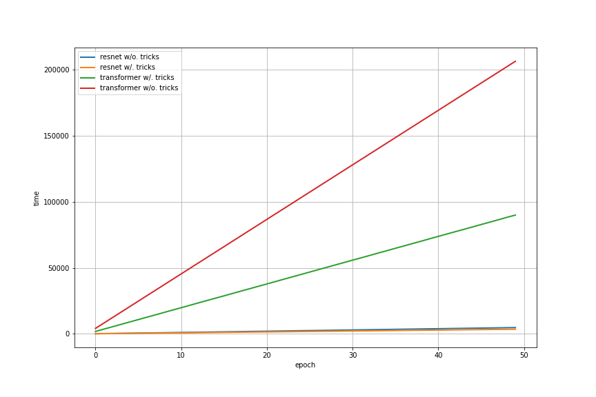
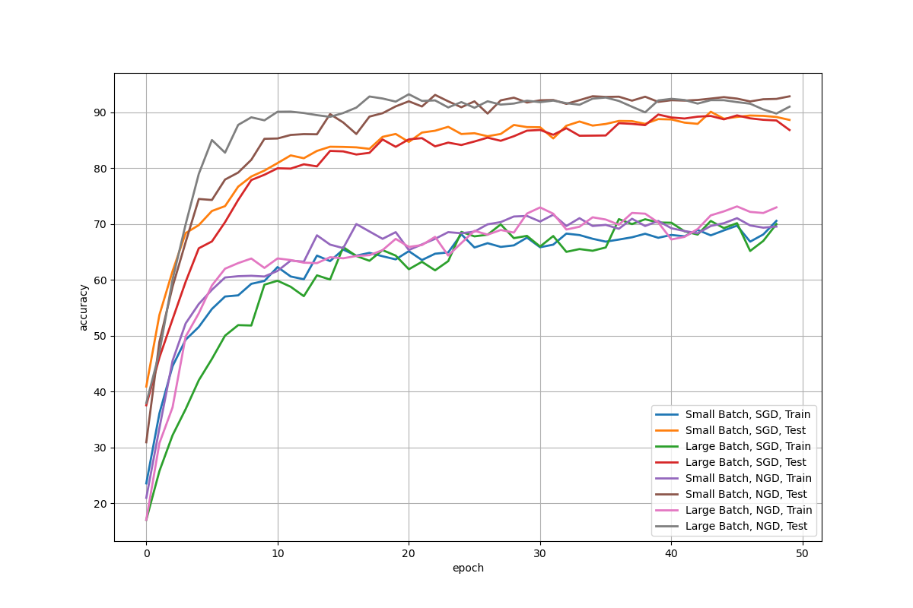
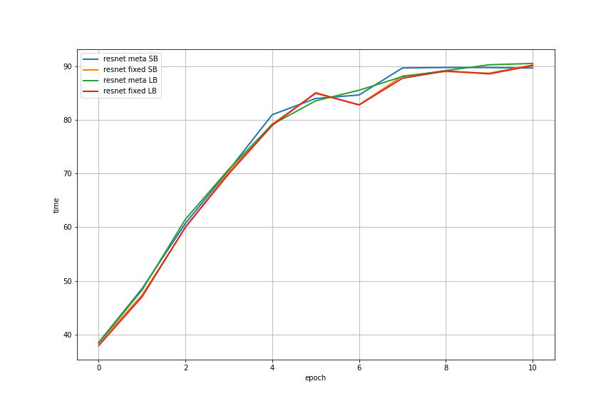

## Introduction

The motivation of this project is to reduce GPU hours and memory cost on large models and data batch. We aim to propose a faster and more robust distributed training approach with consideration of two major factors: speed and accuracy. For accuracy, we applied natural gradient descent, mixup and its variant; for speed, we deployed Apex/ORT training, along with a series of training acceleration tricks including non-blocking data loading, module fusion and distributed training with omp and torchrun. We evaluate our proposal with two major deep learning architectures, CNN and transformer, with the tasks being classification tasks.


## Code Structure

The folder `tuning` serves for hyper-parameter tuning. The core difference from regular training script is we sample a subset of original dataset to get a fast hyper-parameter determination with shell scripts. The major implementations are `resnet50_test.py` and `transformer_test.py`, and all bash files including ones in `tuning` folder are executable scripts to trigger training. Others can be viewed as helper functions.


## Quick Start

Let's start by checking at least four GPUs existing in your server (if distributed training is enabled) with CUDA installed. You can check with `nvidia-smi` command.  Once completed, let's move on with dependency installation.

```bash
pip install -r requirements.txt
```

There are two main entrances you can start with: `resnet50_test.py` and `transformer_test.py` . While `resnet50_test.py` is for resnet50+Cifar10 training, `transformer_test.py` is for transformer+AGNews training.

If you have multi-GPUs and wish to train the model with distributed training, you can execute the bash file with the following commands:

```bash
bash run_distributed.sh
```

If you wish to train the model without distributed training, there are a variety of commands to activate training, one example will be

```bash
python resnet50_test.py --bs 64 --ngd --meta_learning
```

If you wish to fine tune the training hyper-parameters prior to official training, there is also two scripts: `resnet50_tuning.py` and  `transformer_tuning.py` to generate a subset of the dataset and quickly train with a minor dataset available for learning rate, momentum and weight decay tuning. Inside `tuning` folder, run the shell script with either `resnet50_tuning.sh` or `transformer_tuning.sh` to determine the best practice of hyper-parameter combinations.

```bash
bash resnet50_tuning.sh
bash transformer_tuning.sh
```

During the training, if the pre-assigned port has been occupied, please seek for another available port. If you encounter OOM error, please lower the batch size until such error disappears.


## Datasets

[Cifar10](https://www.cs.toronto.edu/~kriz/cifar.html): image-classification dataset with 10 classes

[AGNews](http://groups.di.unipi.it/~gulli/AG_corpus_of_news_articles.html): text-classification dataset with 4 classes


## Results

We conducted experiments on both CNN and transformer, both image and text classification tasks (mainly CNN). We firstly observed a faster training process with our bag of tricks, with ~2.5x faster.

 

We observed NGD+mixup acts as a positive role in model convergence, especially when apply large batch (bs=256) training.

 

We also observed meta mixup training leads to better performance with minimum extra parameters.

 


## Meet the Authors

Mingzhe Hu, Columbia Engineering

Lisen Dai, Columbia Engineering